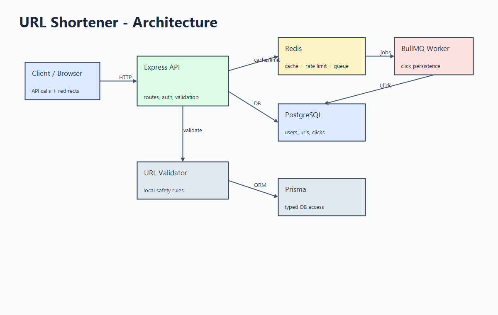
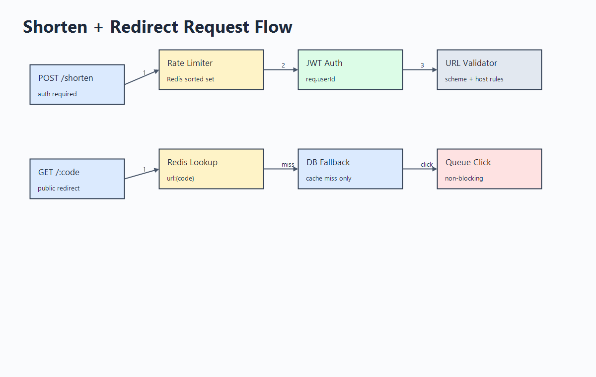
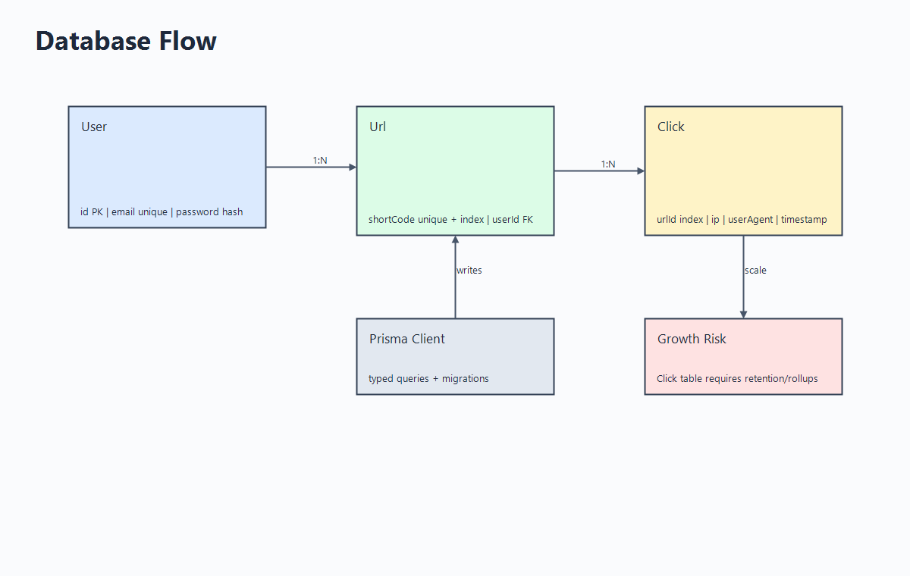
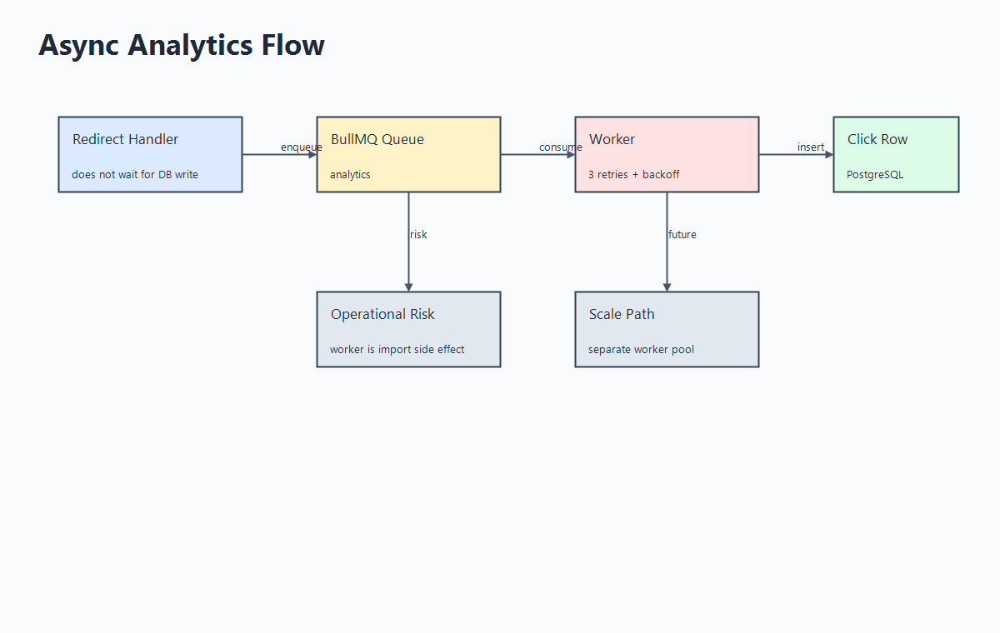

# Architecture

[README](README.md) | [Decisions](DECISIONS.md) | [Technical Debt](TECH_DEBT.md) | [Deployment](DEPLOYMENT.md)

## System Context

| Layer | Responsibility | Implementation |
|---|---|---|
| Client | API calls, browser redirects | any HTTP client |
| API | routing, validation, auth, orchestration | Express + TypeScript |
| DB | durable users, URLs, clicks | PostgreSQL + Prisma |
| Cache | hot redirect lookup | Redis |
| Rate limit | shorten abuse control | Redis sorted sets |
| Queue | click write buffer | BullMQ on Redis |

## Module Map

| Module | Files | Responsibility | Coupling |
|---|---|---|---|
| Bootstrap | `src/index.ts` | Express setup, route mounting | low |
| Auth | `src/routes/auth.routes.ts`, `src/middleware/auth.ts` | register, login, JWT guard | Prisma, JWT env |
| URL routes | `src/routes/url.routes.ts` | shorten, redirect, list, stats | Prisma, Redis, queue, validator |
| Persistence | `src/lib/prisma.ts`, `prisma/schema.prisma` | DB client and schema | PostgreSQL |
| Cache | `src/lib/redis.ts` | Redis client | env config |
| Rate limit | `src/lib/rateLimiter.ts` | sliding-window middleware | Redis, Express |
| Queue | `src/lib/queue.ts` | BullMQ queue + worker | Redis, Prisma |
| Validation | `src/lib/urlValidator.ts` | URL safety checks | pure |
| Encoding | `src/lib/base62.ts` | ID-to-code conversion | pure |

## Request Flow

| Flow | Critical Path | Bottleneck |
|---|---|---|
| Register | validate -> duplicate check -> bcrypt -> insert | bcrypt / DB |
| Login | lookup -> bcrypt compare -> JWT sign | bcrypt |
| Shorten | rate limit -> auth -> validate -> DB create/update -> Redis set | DB writes |
| Redirect hit | Redis get -> expiry check -> queue click -> redirect | Redis |
| Redirect miss | DB lookup -> Redis set -> queue click -> redirect | DB read |
| Stats | owner check -> count/distinct/groupBy | `Click` growth |

## Data Flow

| Data | Source | Sink | Notes |
|---|---|---|---|
| Credentials | client | `User` | password hashed |
| JWT | API | client | 7-day token |
| Short URL | client | `Url`, Redis | Base62 from DB ID |
| Redirect cache | DB/API | Redis | `url:{code}` JSON |
| Click event | request | BullMQ | async enqueue |
| Click record | worker | `Click` | retryable write |

## Async Analytics

| Step | Behavior | Concern |
|---|---|---|
| redirect handler | queues `{ urlId, ip, userAgent }` | enqueue failure is swallowed |
| BullMQ | retries failed jobs 3 times | queue monitoring missing |
| worker | writes `Click` row | starts as import side effect |

## Scaling Risks

| Risk | Why It Matters | Mitigation |
|---|---|---|
| Redis dependency | cache, queue, limiter share Redis | HA Redis, metrics, fallback policy |
| Click table growth | stats degrade as clicks grow | rollups, partitioning, retention |
| Worker/API coupling | web replicas also start workers | separate worker entrypoint |
| Predictable codes | link enumeration possible | random/custom alias option |
| Permanent redirects | clients may cache stale behavior | evaluate `302/307` |

## Diagram Sources

| Diagram | PNG | Excalidraw |
|---|---|---|
| Architecture | [png](docs/diagrams/architecture.png) | [source](docs/diagrams/system-design.excalidraw) |
| Request flow | [png](docs/diagrams/request-flow.png) | [source](docs/diagrams/request-flow.excalidraw) |
| DB flow | [png](docs/diagrams/db-flow.png) | [source](docs/diagrams/db-flow.excalidraw) |
| Async flow | [png](docs/diagrams/async-flow.png) | [source](docs/diagrams/async-jobs.excalidraw) |
| Auth | source only | [source](docs/diagrams/auth.excalidraw) |
| Cache | source only | [source](docs/diagrams/caching.excalidraw) |
| Queue | source only | [source](docs/diagrams/queues.excalidraw) |
| External integrations | source only | [source](docs/diagrams/external-integrations.excalidraw) |
